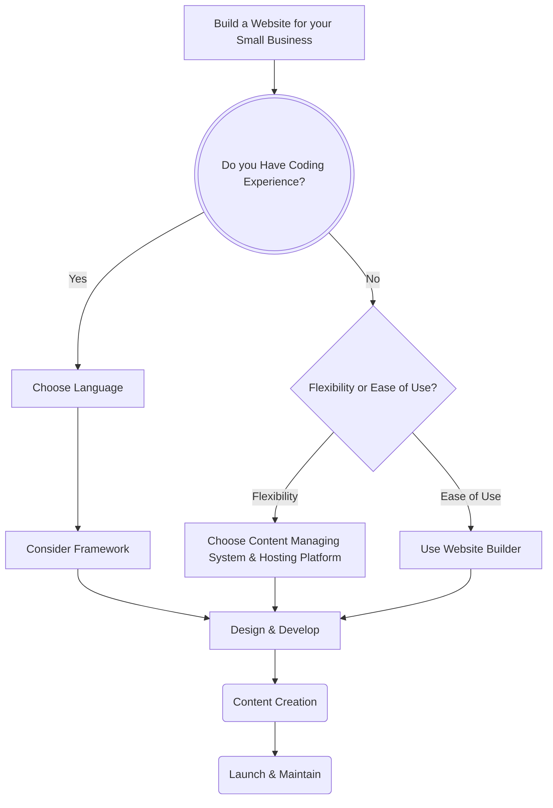

## Documentation
Want to Build a Website?: The process begins at the Decision to build your own website, instead of hiring someone to do it for you.
Coding Experience?: The first decision point is whether the user has coding experience, this determines if they will be coding their own site, or utilizing a visual builder that does not require coding abilities.
Yes: If the user has coding experience, they proceed to "Choose Language."
No: If the user does not have coding experience, they proceed to the next decision point.
Flexibility or Ease of Use? The second decision point is whether the user prioritizes flexibility or ease of use. The user 
Flexibility: If flexibility is preferred, the user chooses a Content Management System (CMS) and hosting platform.
Ease of Use: If ease of use is preferred, the user chooses a website builder that takes care of content management and hosting.
Design & Develop: Regardless of the previous decisions, the next step is "Design & Develop."
Content Creation: After the website is designed and developed, the user creates content for their website.
Launch & Maintain: Finally, the website is launched and requires ongoing maintenance. 
